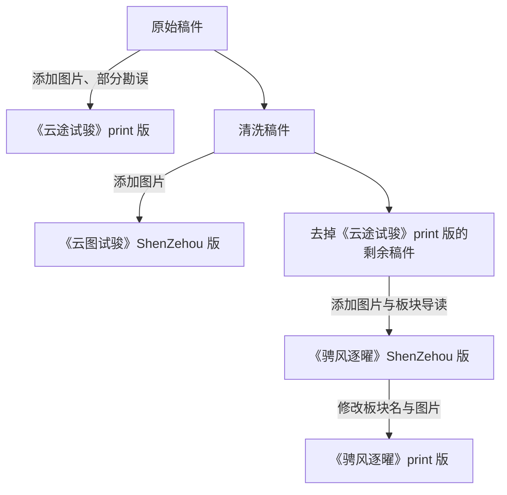

### 概览

欢迎来到《校园运动会特别刊物》2026 年版的 GitHub 仓库。此版本与先前一样，分为两期，第一期付印版为《云途试骏》（`ShenZehou` 方案为《云图试骏》），第二期《骋风逐曜》。注意，此仓库未经媒体部授权，为《鄞年・思叙》编辑部自行上传。因此，我们只能把技术范围内能上传／归档的所有文件都上传到此处。

### 为什么要建立此仓库？

自 2026 学年的学生会媒体部招新以来，媒体部一直面临着技术人手／水平不足的境况。因此，《鄞年・思叙》编辑部与主管媒体部的学生会副主席杨上喆一拍即合，决定让校刊编辑部参与《校园运动会特别刊物》的编辑工作。为了使下次潜在合作更为顺利，也为了将我们的幕后工作流程（如未刊发的稿件）展现给各位，特此建立该仓库。

### 为什么本仓库有两个分支？

因为协调混乱的缘故，实际上参与校刊编辑制作的有四方：

- 学校
   - 代表人物：李锦涛
   - 主要负责：
      - 划定大框架
      - 决定小部分稿件编排
- 学生会媒体部
   - 代表人物：杨上喆
   - 主要负责：
      - 初步审稿
      - 封面制作
      - 稿件编排
- 《鄞年・思叙》编辑部
   - 代表人物：沈泽厚
   - 主要负责：排版
- 上期《校园运动会特别刊物》执行编辑
   - 代表人物：段嘉瑞
   - 主要负责：排版

因此，两个分支代表的是本刊的两种不同走向：

- `print` 分支
   - 校方最终印刷的情况
- `ShenZehou` 分支
   - 完全按《鄞年・思叙》编辑部设想进行的情况
- 说明
    - 因《云途试骏》除封面外完全由上期编辑制作，其使用的是未经清洗的、业已遗失的原 DOCX / DOC / EML 稿件，且其班级与标点格式不统一，所以其对稿件的改动（包括图片）将不能也不会反映在仓库内
    - 因编辑部在《云图试骏》上提供的方案不幸落选，但由于 AI 的速度与质量优势，成功进行了《骋风逐曜》的制作
    - 但因编辑部的 AI 的 Session 配额耗尽与时间限制，校方又在编辑部提交《骋风逐曜》最终版本后继续使用了某 PDF 编辑器（WPS？）进行了编辑
    - 

### 我们的工作流程

- [x] 与校方对接
- [x] 征稿
- [x] 校方对稿件提出要求
- [x] 媒体部初审稿件
- [x] 《云途试骏》封面制作
- [x] 选择《云途试骏》入选稿件
- [x] 决定《云途试骏》稿件顺序
- [x] 《云途试骏》排版
- [x] 《云途试骏》校对、修改
- [x] 决定《骋风逐曜》稿件顺序
- [x] 《云途试骏》印刷
- [x] 《骋风逐曜》排版
- [x] 《骋风逐曜》校对、修改
- [x] 《骋风逐曜》印刷
- [x] 《云途试骏》印刷纸质版发放
- [x] 《骋风逐曜》印刷纸质版发放

注：除仓库整理与征稿，一切工作都在 2026 年 9 月 28 日夜至 30 日晨的不足 48 小时内完成。

### 我们的编辑流程

### 文件夹与命名规则

各分支使用同一套规则，板块名称和稿件内容按对应成品确定。

| 位置 | 规则 |
| --- | --- |
| `第一期/`、`第二期/` | 本分支成品实际刊载的稿件、索引与前后置内容。未制作第二期的分支不设第二期成品目录。 |
| `0_前置/` | 人员表、卷首语和开幕式致辞等，以两位数字按刊载顺序编号。 |
| `1_板块名/`、`2_板块名/`…… | 板块用单数字前缀，按成品顺序与实际板块名排列。 |
| `0_导读.md` | 所属板块的导读；没有独立导读的版本不补写。 |
| `01_篇名_班级_作者.md` | 正文在板块内用两位数字编号。题名、班级和姓名按成品记录，未署名时省略缺项。 |
| `目录.md` | 本期稿件链接、刊面页与 PDF 物理页，以发布文件核对。 |
| `卷尾语.md` | 放在期刊根目录，保存该版本的卷尾语。 |
| `待选稿/` | 未进入本分支成品的稿件，去掉旧排序号；旧已过审、未过审归拢至此。未采用导读放在其 `导读/` 子目录。 |
| `信息缺失/` | 未刊载且作者、班级等资料仍缺失的稿件。 |
| `原稿/` | 需要与刊载署名区别的重要原稿，例如正确署名为 2616 吴彦初的《形言》。 |
| `资产/` | 原稿照片、封面、扉页和素材。`print` 特有或最终替换图按期收在 `资产/配图/第一期/`、`第二期/`。 |
| `排版/` | 制作源码、字体与历史输出。各分支入口见自己的制作说明；旧 HTML、PDF、版面 JSON 保留当时状态。 |

班级号沿用本项目四位表示法：2026 年刊载时，高一、高二、高三分别对应 26、25、24 开头的班号，「高三（6）班」记为 2406。序号表示阅读顺序。同稿件确实刊于两期或两版时，各自保存刊载文字。

正文保留成品实际字词和分节；字体、网格及生成线描由排版源码负责。`ShenZehou` 保留原图片引用和配图方式；`print` 仅把成品专有或最终替换图提取后嵌入对应稿件，见[新增成品配图](<资产/配图/新增成品配图.md>)。

刊载记录与核实后的作者归属分别保存。《形言》在 `print`／`DuanJiarui` 中误署为「高三（6）班 冯欣悦」，成品稿按 2406 冯欣悦归档；正确署名原稿见[原稿/形言_2616_吴彦初.md](<原稿/形言_2616_吴彦初.md>)。

### 本分支说明

| 期刊 | 板块与正文篇数 | 索引 |
| --- | --- | --- |
| 《云途试骏》 | 1_赴新征 7；2_奋云程 6；3_笃前行 4；4_逐韶光 7 | [第一期目录](<第一期/目录.md>) |
| 《骋风逐曜》 | 1_启新章 9；2_竞风华 8；3_踏平川 8；4_溯光行 14 | [第二期目录](<第二期/目录.md>) |

第二期 `print` 撤去了《于喘息之间，寻得生命的旷野》，加入《星与路灯》。导读、人员表、卷尾语与部分正文也分别按最终文件归档。

本分支 `排版/` 保留第二期制作源码，输入路径已同步。历史输出来自编辑部制作阶段；校方后来直接编辑 PDF，正式印刷成品以 Release 为准，制作细节见[排版说明](<排版/README.md>)。

第一期历史勘误只保留在 `DuanJiarui` 的 [V5校样更正.md](https://github.com/Yinzhou-High-School-Campus-Journal/Sports-Day-Issues-2026/blob/DuanJiarui/V5%E6%A0%A1%E6%A0%B7%E6%9B%B4%E6%AD%A3.md)。「V5」仅保留为历史文件名，正文引用采用新成品名。
