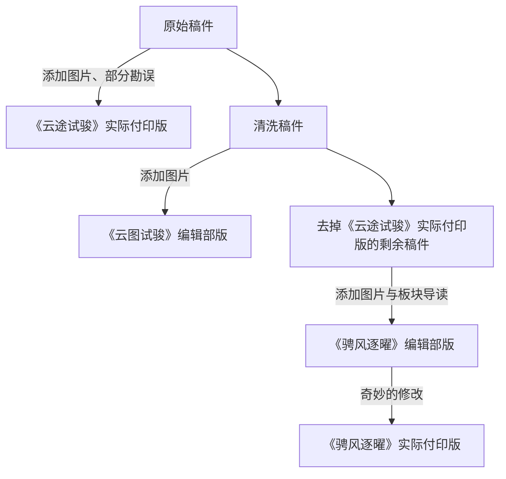

### 概览

欢迎来到《校园运动会特别刊物》2026 年版的 GitHub 仓库。此版本与先前一样，分为两期，第一期付印版为《云途试骏》，第二期为《骋风逐曜》。注意，此仓库未经媒体部授权，为《鄞年・思叙》编辑部自行上传。因此，我们只能把技术范围内能上传／归档的所有文件都上传到此处。

### 为什么要建立此仓库？

自 2026 学年的学生会媒体部招新以来，媒体部一直面临着技术人手／水平不足的境况。因此，《鄞年・思叙》编辑部与主管媒体部的学生会副主席杨上喆一拍即合，决定让校刊编辑部参与《校园运动会特别刊物》的编辑工作。为了使下次潜在合作更为顺利，也为了将我们的幕后工作流程（如未刊发的稿件）展现给各位，特此建立该仓库。

### 本仓库能多大程度上反映工作流程？

因为协调混乱的缘故，实际上参与校刊编辑制作的有四方：

- 学校
   - 代表人物：李锦涛
   - 主要负责：
      - 划定大框架
      - 决定小部分稿件编排
- 学生会媒体部
   - 代表人物：杨上喆
   - 主要负责：
      - 初步审稿
      - 封面制作
      - 稿件编排
- 《鄞年・思叙》编辑部
   - 代表人物：沈泽厚
   - 主要负责：排版
- 上期《校园运动会特别刊物》执行编辑
   - 代表人物：段嘉瑞
   - 主要负责：排版

以下是这四方具体的编辑流程：

注：

- 《云途试骏》除封面外完全由上期编辑制作，其使用的是未经清洗的、业已遗失的原 DOCX / DOC / EML 稿件，班级与标点格式也不统一
- 编辑部在《云途试骏》上提供的方案不幸落选（不只因为把刊名听成了《云图试骏》），但由于 AI 的速度与质量优势，成功进行了《骋风逐曜》的制作
- 但因编辑部的 AI 的 Session 配额耗尽与时间限制，校方又在编辑部提交《骋风逐曜》最终版本后继续使用了某 PDF 编辑器（WPS？）进行了编辑
- 当然，成品仍然可在 [Releases](https://github.com/Yinzhou-High-School-Campus-Journal/Sports-Day-Issues-2026/releases) 中查看。仓库同时保留[各版本的目录](#稿件与版本记录)、《云途试骏》`print` 版的[勘误](<版本记录/第一期印刷版勘误.md>)与两版《骋风逐曜》的[差异说明](<版本记录/第二期两版详细比较.md>)。

### 付印版本的工作流程

- [x] 与校方对接
- [x] 征稿
- [x] 校方对稿件提出要求
- [x] 媒体部初审稿件
- [x] 《云途试骏》封面制作
- [x] 选择《云途试骏》入选稿件
- [x] 决定《云途试骏》稿件顺序
- [x] 《云途试骏》排版
- [x] 《云途试骏》校对、修改
- [x] 决定《骋风逐曜》稿件顺序
- [x] 《云途试骏》印刷
- [x] 《骋风逐曜》排版
- [x] 《骋风逐曜》校对、修改
- [x] 《骋风逐曜》印刷
- [x] 《云途试骏》印刷纸质版发放
- [x] 《骋风逐曜》印刷纸质版发放
- [x] GitHub 仓库整理、归档

注：除仓库整理与征稿，一切工作都在 2026 年 9 月 28 日夜至 30 日晨的不足 48 小时内完成。

### 文件夹与命名规则

仓库仅维护 `main`，保留制作阶段的提交历史。稿件分类与阅读顺序采用两个编辑部方案；来源稿保留反抄前文字，外部 PDF 编辑集中记录于成品、目录、勘误与差异说明，不回写稿件。发行文件名中的 `Print`、`ShenZehou` 是历史版本标识。

| 位置 | 规则 |
| --- | --- |
| `第一期/`、`第二期/` | 编辑部方案的来源稿、导读、前后置内容与目录。 |
| `0_前置/` | 人员表、卷首语和致辞，以两位数字按阅读顺序编号。 |
| `1_板块名/`、`2_板块名/`…… | 板块使用单数字前缀，按对应编辑部方案排列。 |
| `0_导读.md` | 所属板块的来源导读。 |
| `01_篇名_班级_作者.md` | 板块内正文用两位数字编号；题名、班级、作者以来源稿为准。未署名时省略缺项。 |
| `目录.md` | 记录顺序、刊载署名和页码，链接到来源稿。PDF 页从内页文件第一页起计，刊面页取纸面页脚。 |
| `卷尾语.md` | 放在期刊根目录，保留编辑部来源稿。 |
| `待选稿/` | 未进入这两个编辑部方案的来源稿，去掉旧排序号。可能已被实际付印版采用，刊载状态以各版本目录为准。不同的旧前置稿与导读分别放入 `前置/`、`导读/`。 |
| `信息缺失/` | 作者、班级等信息尚不完整的来源稿，不推测补齐。 |
| `资产/` | 编辑部原有照片、封面、扉页与制作素材。 |
| `排版/` | 编辑部制作源码、字体与历史输出；第一期入口在本目录，第二期入口在 `第二期/` 子目录。 |
| `版本记录/` | 实际付印版目录、第一期勘误、跨版本区别表与第二期详细比较。外部改动集中记录于此。 |

班级沿用四位编号：2026 年高一、高二、高三分别为 26、25、24 开头；「高三（6）班」记为 2406。序号表示阅读顺序。同稿在两期确有编辑部修订时，保留各期来源版本。

### 稿件与版本记录

| 期刊 | 编辑部方案目录 | 实际付印版目录 |
| --- | --- | --- |
| 第一期 | [《云图试骏》](<第一期/目录.md>) | [《云途试骏》](<版本记录/第一期印刷版目录.md>) |
| 第二期 | [《骋风逐曜》](<第二期/目录.md>) | [《骋风逐曜》](<版本记录/第二期印刷版目录.md>) |

[稿件区别表格](<版本记录/稿件区别表格.md>)记录第一期与跨期的入选、分类和正文差异，并汇总四份发行文件的指纹。

制作方法见[排版说明](<排版/README.md>)。
