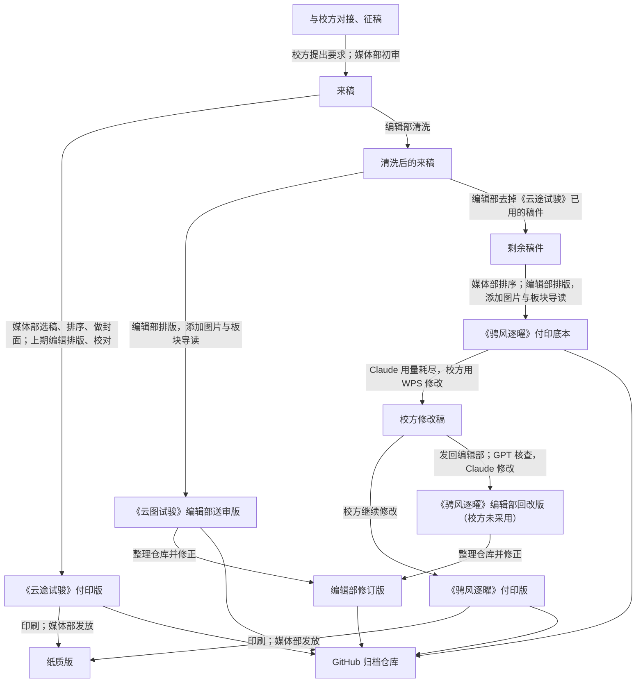

### 概览

欢迎来到《校园运动会特别刊物》（简称校运会特刊）2026 年版的 GitHub 仓库。此版本与先前一样，分为两期，第一期付印版为《云途试骏》，第二期为《骋风逐曜》。注意，此仓库未经媒体部授权，为《鄞年・思叙》编辑部自行上传。因此，这里只能收录编辑部手头有、技术上能上传或归档的文件。

### 为什么要建立此仓库？

自 2026 学年的学生会媒体部招新以来，媒体部一直面临着技术人手／水平不足的境况。因此，《鄞年・思叙》编辑部与主管媒体部的学生会副主席杨上喆一拍即合，决定让校刊编辑部参与《校园运动会特别刊物》的编辑工作。为了使下次潜在合作更为顺利，也为了将我们的幕后工作流程（如未刊发的稿件）展现给各位，特此建立该仓库。

### 本仓库能多大程度上反映工作流程？

因为协调混乱的缘故，实际上参与校运会特刊编辑制作的有四方：

- 校方
   - 代表人物：李锦涛
- 学生会媒体部
   - 代表人物：杨上喆
- 《鄞年・思叙》编辑部
   - 代表人物：沈泽厚
- 上期编辑
   - 代表人物：段嘉睿

以下是这四方具体的编辑流程：

注：

- 两期的排版和付印文件都在 2026 年 9 月 27 日夜至 29 日晨完成。
- 《云途试骏》除封面外，技术上完全由上期编辑制作，其使用的是未经清洗的、业已遗失的原 DOCX、DOC、EML 稿件，班级与标点格式也不统一。
- 编辑部为第一期提供的方案不幸落选（编辑部当时还把刊名听成了《云图试骏》，编辑部版沿用至今），但借助 AI（Claude Opus 5.5 与 GPT-6.1 Sol）的速度与质量优势，成功完成了《骋风逐曜》的制作。
- 制作《骋风逐曜》付印底本时，AI 把《云图试骏》当成了刊名（应为《校运会特刊》），底本的封面和扉页因此印作「云图试骏 第二期」。编辑部交出付印底本后，Claude 的用量已经耗尽，校方便用 WPS 直接修改 PDF。校方改了一部分后把修改稿发回编辑部，编辑部交给 GPT 核查，发现不少问题，等 Claude 用量重置后据此回改，准备次日早上交回，但校方没有采用，按自己的修改稿付印（付印版 PDF 中留有 WPS 的编辑痕迹）。
- 整理仓库时，编辑部又修正了署名、个别字句与文件信息，得到现在的编辑部修订版（`2026.10.7` 中文件名后缀为 `ED` 的文件；下文和各目录中的「编辑部版」都指修订版）。第一期修订版以送审版为基础，两期共有的稿件按第二期的改动统一；第二期以回改版为基础，所以第二期两版的差异有三个来源：校方的修改、编辑部未被采用的回改，以及整理时的修正。
- 综上，由于来源混乱，本仓库的稿件只能按编辑部版整理，付印版只能在 [Releases](https://github.com/Yinzhou-High-School-Campus-Journal/Sports-Day-Issues-2026/releases) 中获取 PDF：`2026.9.29` 收纳付印时的原件（老师发来的付印版、第一期送审版与第二期付印底本），`2026.10.7` 收纳文印室提供的最终付印文件与编辑部修订版。[各版本的目录与比较](#版本区别)是事后整理的，仅供参考。

### 文件夹与命名规则

| 位置 | 内容 |
| --- | --- |
| `第一期/`、`第二期/` | 两期编辑部版的稿件、板块导读、前后置内容与目录。 |
| `0_前置/` | 人员表、卷首语和致辞，以两位数字按阅读顺序编号。 |
| `1_板块名/`、`2_板块名/`…… | 板块以一位数字按编辑部版的顺序编号。 |
| `00_导读.md` | 板块导读。 |
| `01_篇名_班级_作者.md` | 板块内的稿件，以两位数字按阅读顺序编号；篇名、班级、作者以来稿为准（经编辑部更正的除外，如《山顶的云海日出》的作者），未署名时省略缺项。 |
| `目录.md` | 编辑部版目录。 |
| `卷尾语.md` | 第二期卷尾语。 |
| `未选入/` | 未收入两期编辑部版的来稿，文件名不编号。其中一部分被付印版采用，见付印版目录。 |
| `信息缺失/` | 作者、班级等信息不全的来稿，不推测补齐。其中《雪崩之下，何以为家》被第一期付印版采用。 |
| `资产/` | 稿件原图，按「篇名_班级_作者_序号」命名，缺项省略；`配图/` 为排版用的视频截图，按「场景_画面_来源」命名。 |
| `版本记录/` | 付印版目录、第一期付印版勘误与两期的两版比较。 |
| `排版/` | 编辑部版的制作程序与字体。 |

班级沿用四位编号：2026—2027 学年的高一、高二、高三分别为 26、25、24 开头；「高三（1）班」记为 2401。

第二期编辑部版是从第一期付印版没用到的稿件里选的，其中有 16 篇也收在第一期编辑部版里（目录中注「同见第一期」或「同见第二期」）。两期各保留一份副本，文字相同。这不表示付印版两期重复刊载，付印版的篇目以其目录为准。

### 版本区别

| 期刊 | 编辑部版目录 | 付印版目录 | 两版比较 |
| --- | --- | --- | --- |
| 第一期 | [《云图试骏》](<第一期/目录.md>) | [《云途试骏》](<版本记录/第一期付印版目录.md>) | [第一期两版比较](<版本记录/第一期两版比较.md>)、[付印版勘误](<版本记录/第一期付印版勘误.md>) |
| 第二期 | [《骋风逐曜》](<第二期/目录.md>) | [《骋风逐曜》](<版本记录/第二期付印版目录.md>) | [第二期两版比较](<版本记录/第二期两版比较.md>) |

目录中的「刊面页」是纸面页脚上的页码，与刊物目录一样只标起始页；「PDF 页」从文件第一页起算，标出起止页。

### 技术参考

编辑部版的制作程序、字体，以及可供下期参考的经验，见[排版说明](<排版/README.md>)。

### 权利说明

转载、引用或改编本仓库内容前，请先阅读[权利说明](<RIGHTS.md>)。
