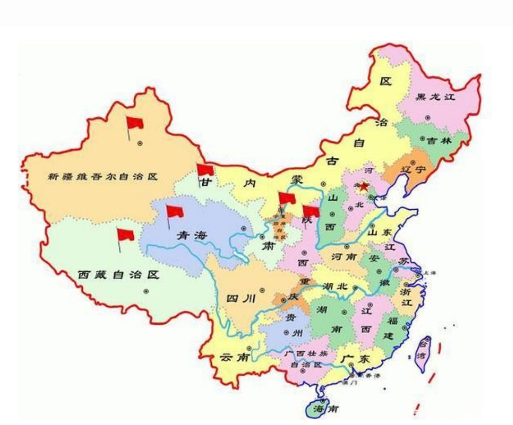
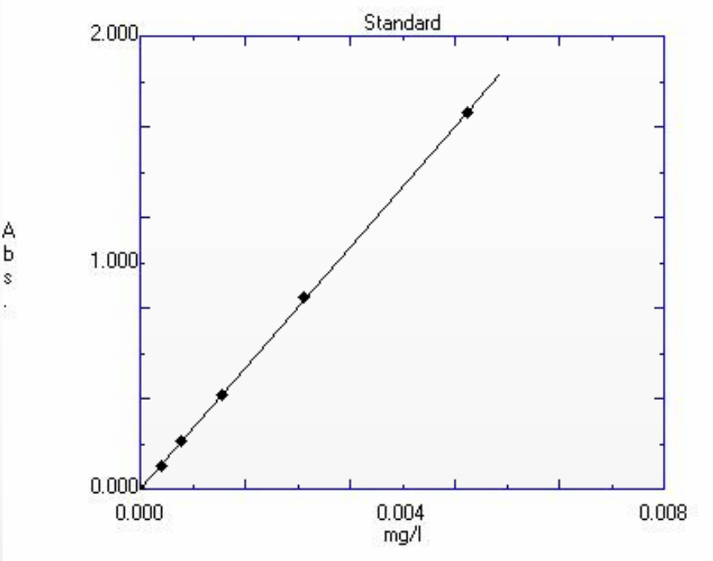
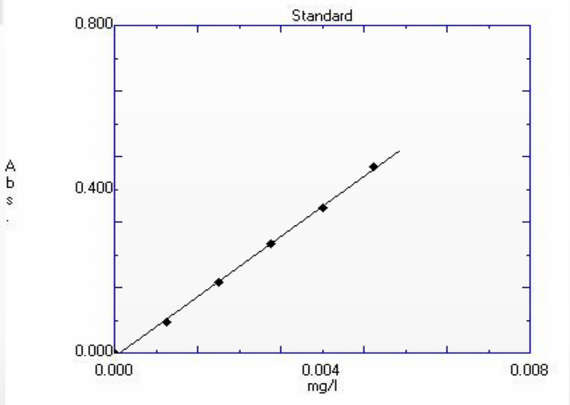

# 枸杞中β-胡萝卜素的测定

（作者不详）

---

### 一、研究背景和意义

枸杞子为茄科枸杞属植物，宁夏枸杞（Lycium barbarum L.）的干燥成熟果实，是名贵的药食同源中药。枸杞早在殷商时期就已经开始种植了，《诗经》中有记载：「陟彼北山，言采其杞，显允君子，莫不令德。」枸杞的妙用在《本草纲目》《神农本草经》《千金方》等古书中也有记载。

枸杞子在全国的主要产地分布图如下图1所示，可知枸杞的分布：主要有8个种和3个变种，在我国分布广泛，其中宁夏枸杞分布最广泛。

图1 枸杞子在全国的主要产地分布

国内枸杞的种类：宁夏枸杞、黄果枸杞、中国枸杞、北方枸杞、新疆枸杞、红枝枸杞、柱筒枸杞、截萼枸杞、黑果枸杞、云南枸杞、昌吉枸杞，其中黄果枸杞和北方枸杞、红枝枸杞属于变种类枸杞。

枸杞子的化学成分：

1.枸杞多糖；

2.甜菜碱；

3.类胡萝卜素；

4.蛋白质；

5.氨基酸；

6.黄酮；

7.VC；

8.总糖。

枸杞子的药理作用：

1.增强免疫力；

2.抗肿瘤；

3.抗氧化；

4.防衰老；

5.降血脂；

6.增加造血功能。

### 二、研究现状

1、β-胡萝卜素是中药枸杞中重要的一类活性物质，而目前对其含量的测定鲜有报道。

2、β-胡萝卜素是胡萝卜素中的一种最普通的异构体。以异戊二烯残基为单元组成的共轭双键，属多烯色素。呈深红紫至暗红色有光泽的斜方六面体或板状微结晶的晶体或结晶性粉末。有轻微异臭和异味。不溶于水、丙二醇、甘油、酸和碱，溶于二硫化碳、苯、三氯甲烷，微溶于乙醚、石油醚、环己烷及植物油，几乎不溶于甲醇和乙醇。稀溶液呈橙黄或黄色，浓度增大时呈橙色至橙红色；对光、热、氧不稳定，不耐酸，但对弱碱性比较稳定；不受抗坏血酸等还原剂的影响，重金属离子尤其是Fe3+可促使其褪色；对油脂性食品的着色性能良好。ADI值0-5mg/kg（FAO/WHO，2001），LD50 >8000mg/kg（油溶液，狗，经口）。

属于可以使用的食用合成橙黄色色素，具有维生素的活性，安全性比其他合成着色剂高。

3、β-胡萝卜素可以防止维生素A缺乏症、防止辐射病、防老抗衰、防癌抗癌及防止心血管疾病等药理作用，也可以作食品和化妆品的天然色素及饲料添加剂。

4、我国β-胡萝卜素产品主要依赖进口，因此开发β-胡萝卜素资源、生产天然β-胡萝卜素产品的研究工作很有意义。

### 三、研究目的

1、本实验拟使用不同溶剂提取不同粉碎度及不同生产厂家的枸杞子中β-胡萝卜素，考察溶剂、粉碎度、枸杞子生产厂家对β-胡萝卜素含量的影响。

### 四、实验过程

#### 一、准备材料

1、实验药材：

杞里香（宁夏杞里香枸杞有限责任公司，2023.06.21）

枸杞子（南京松龄中药饮片有限公司，230112）

2、分析标准品：β-胡萝卜素（阿拉丁，Lot#k2226377）

3、粉碎度：未处理、剪碎。

4、提取溶剂：石油醚（60-90度）、丙酮。

5、实验仪器：万分之一天平（舜宇恒平仪器ME224）、超声波清洗机（洁康）、

分光光度计（岛津UV-2501PC）。

6、实验器材：剪刀、滴管、锥形瓶、漏斗、容量瓶、

圆形滤纸、移液枪、称量纸。

#### 二、粉碎枸杞

将以下两种枸杞未处理或剪碎，枸杞样品的处理如下：

1、杞里香（剪碎）

2、杞里香（未处理）

3、枸杞子（剪碎）

4、枸杞子（未处理）

5、杞里香（剪碎）

6、枸杞子（剪碎）

#### 三、称量

精确称量以上枸杞样品各2.0克。

#### 四、配瓶

将六份枸杞样品装入三角瓶中。

#### 五、加入药剂

1、杞里香（剪碎）

2、杞里香（未处理）

3、枸杞子（剪碎）

4、枸杞子（未处理）

5、杞里香（剪碎）

6、枸杞子（剪碎）

1-4样品加入石油醚20mL，5、6加入丙酮20mL。

#### 六、超声

将加好溶剂的样品三角瓶盖上保鲜膜放入超声机，100W，半小时，取出。

#### 七、过滤

将圆形滤纸放入漏斗，再把漏斗放入三角瓶，最后用滴管将三角瓶中的液体吸入容量瓶。

重复4-6步骤。

#### 八、定容

将样品用溶剂定容到50mL，待测。

#### 九、光谱扫描

光谱扫描，确定最大吸收波长。

β-胡萝卜素在石油醚中的最大吸收波长为450.20nm。在丙酮中的最大吸收波长为453.20nm。

### 五、实验分析与结论

#### 一、称量结果

表1 枸杞样品（6组）

| 序号 | 样品名 | 称量结果（g） |
| --- | --- | --- |
| 1 | 枸杞子（未处理）待加石油醚 | 2.0405 |
| 2 | 杞里香（未处理）待加石油醚 | 2.0001 |
| 3 | 杞里香（剪碎）待加石油醚 | 2.0455 |
| 4 | 枸杞子（剪碎）待加石油醚 | 2.0851 |
| 5 | 杞里香（剪碎）待加丙酮 | 2.0636 |
| 6 | 枸杞子（剪碎）待加丙酮 | 2.0898 |

#### 二、石油醚作为溶剂β-胡萝卜素标准曲线结果

图2 石油醚作为溶剂β-胡萝卜素标准曲线

Multi-Point Working Curve

Conc = k1 A + k0

k1 = 0.00300 k0 = -5.838e-6

Chi-Square: 0.00237

Number of Points:6

表2 不同枸杞-石油醚样品的吸光度

| Std # | Conc.（浓度） | Abs.（吸光度） |
| --- | --- | --- |
| 1 | 0.0000 | 0.000 |
| 2 | 0.0003125 | 0.103 |
| 3 | 0.0006250 | 0.208 |
| 4 | 0.001250 | 0.417 |
| 5 | 0.002500 | 0.851 |
| 6 | 0.005000 | 1.661 |

| Wavelength | 450.2 |
| --- | --- |
| Slit Width | 2.0 |

#### 三、丙酮作为溶剂β-胡萝卜素标准曲线结果

图3 丙酮作为溶剂β-胡萝卜素标准曲线

Multi-Point Working Curve

Conc = k1 A + k0

k1 = 0.0108 k0 = 0.0000934

Chi-Square: -0.00765

Number of Points: 6

表3 不同枸杞-石油醚样品的吸光度

| Std # | Conc. | Abs. |
| --- | --- | --- |
| 1 | 0.0000 | 0.000 |
| 2 | 0.001000 | 0.075 |
| 3 | 0.002000 | 0.172 |
| 4 | 0.003000 | 0.268 |
| 5 | 0.004000 | 0.354 |
| 6 | 0.005000 | 0.456 |

| Wavelength | 453.2 |
| --- | --- |
| Slit Width | 2.0 |

#### 四、样品石油醚提取测定结果

表4 枸杞子药品（未粉碎）的吸光度

| ID | Conc. | Abs. |
| --- | --- | --- |
| 1 | 0.000115 | 0.040 |
| 2 | 0.000114 | 0.040 |
| 3 | 0.000113 | 0.040 |
| 4 | 0.000536 | 0.181 |
| 5 | 0.000536 | 0.181 |
| 6 | 0.000536 | 0.181 |
| 7 | 0.00306 | 1.025 |
| 8 | 0.00306 | 1.024 |
| 9 | 0.00306 | 1.024 |
| 10 | 0.00338 | 1.130 |
| 11 | 0.00338 | 1.130 |
| 12 | 0.00338 | 1.131 |

表5 枸杞子β-胡萝卜素含量

| 序号 | 样品名 | 含量测定结果（%） |
| --- | --- | --- |
| 1 | 枸杞子（未粉碎） | 0.00279 |
| 2 | 杞里香（未粉碎） | 0.00134 |
| 3 | 杞里香（粉碎） | 0.00748 |
| 4 | 枸杞子（粉碎） | 0.00811 |

含量（%）=测定浓度（mg/mL）\*稀释倍数（50）/称量（mg）\*100%。四组数据的STD（标准方差）值均小于0.0001%。

#### 五、样品丙酮提取测定结果

表6 不同枸杞-丙酮样品的吸光度

| ID | Conc. | Abs. |
| --- | --- | --- |
| 1 | 0.000943 | 0.317 |
| 2 | 0.000944 | 0.317 |
| 3 | 0.000943 | 0.316 |
| 4 | 0.000692 | 0.233 |
| 5 | 0.000691 | 0.232 |
| 6 | 0.000693 | 0.233 |

表7 枸杞子β-胡萝卜素含量

| 序号 | 样品名 | 含量测定结果（%） |
| --- | --- | --- |
| 1 | 杞里香（粉碎） | 0.00228 |
| 2 | 枸杞子（粉碎） | 0.00166 |

两组数据的STD（标准方差）值均小于0.0001%。

### 六、研究结论

1、粉碎度对实验结果有影响，相同的提取溶剂，不同的粉碎程度，粒度小的比粒度大的提取效率高。

2、不同溶剂提取对实验结果有影响，相同粉碎程度，石油醚的提取效率高于丙酮。

3、不同的生产厂家的枸杞中的β-胡萝卜素含量有差异。

### 七、实践结果与体会

1、本实验中杞里香（粉碎）石油醚提取样品中途因操作不当，洒出部分样品，可能导致实验数据的不准确。

2、定容的时候高于凹液面，也有可能导致实验结果的不准确。

3、溶剂的选择对实验结果有影响，后续实验可以进一步优化最佳溶剂。

4、因产地不同、枸杞干燥工艺不同，不同生产厂家枸杞子中的β-胡萝卜素有差异，后续我们可以多比较不同厂家、不同品种的枸杞子，从中选出β-胡萝卜素含量最高的枸杞子。

### 八、参考文献

[1]王亚军,郭素娟,安巍等.5种枸杞的果实性状及主要营养成分[J].森林与环境学报,2016,36(03):367-372.DOI:10.13324/j.cnki.jfcf.2016.03.019.

[2]李重. 土壤和采收季节对三个产地宁夏枸杞活性成分的影响[D].福建农林大学,2016.

[3]王益民,张珂,许飞华等.不同品种枸杞子营养成分分析及评价[J].食品科学,2014,35(01):34-38.

[4]如克亚·加帕尔,孙玉敬,钟烈州等.枸杞植物化学成分及其生物活性的研究进展[J].中国食品学报,2013,13(08):161-172.DOI:10.16429/j.1009-7848.2013.08.001.

[5]孙波,黄昊,王娟等.不同产地枸杞中β-胡萝卜素的含量及其抗氧化活性研究[J].时珍国医国药,2012,23(07):1666-1667.

[6]鲍会梅.枸杞中β-胡萝卜素含量及影响因素的分析[J].四川食品与发酵,2008(02):63-66.
