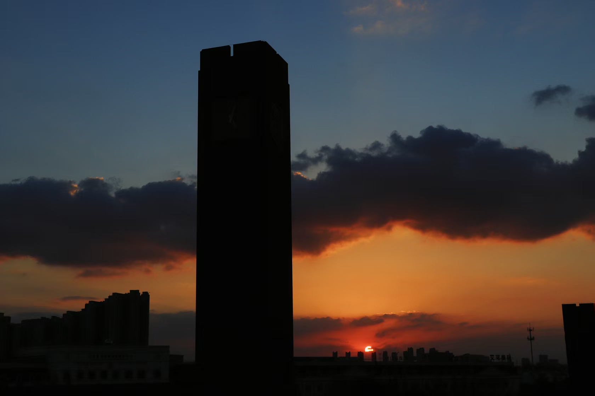
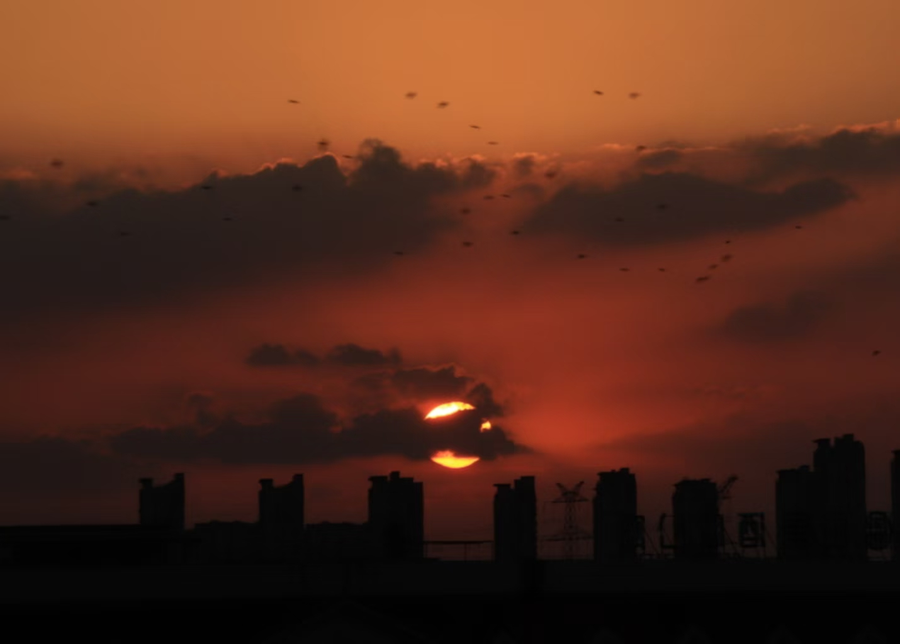
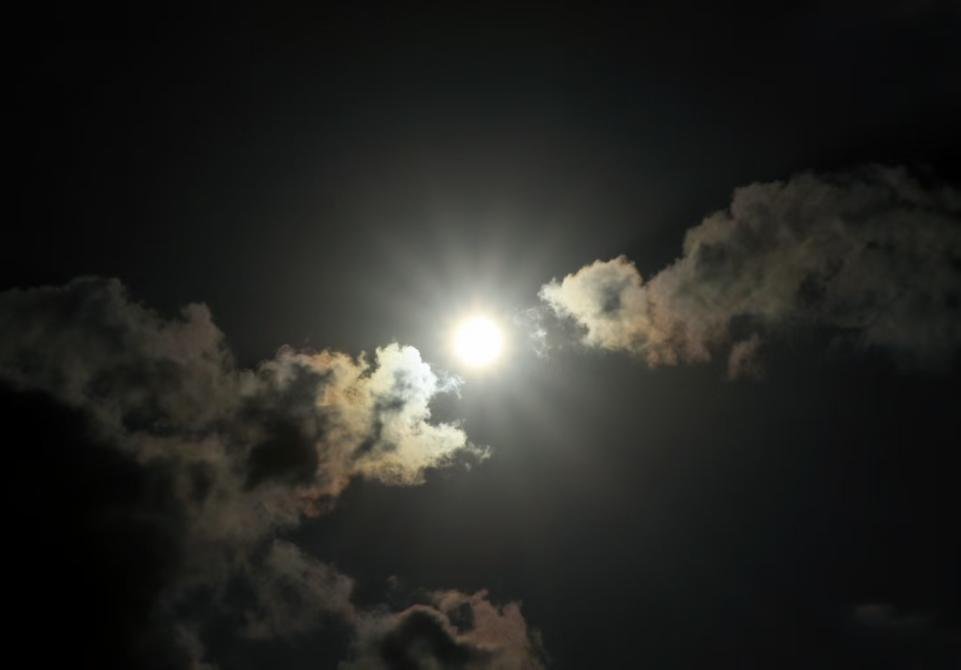
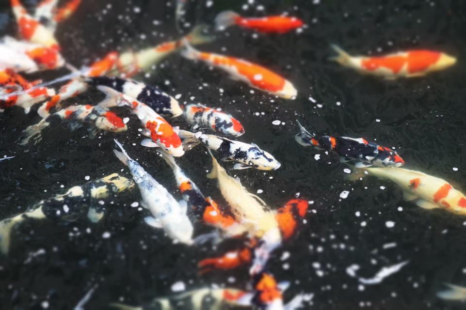
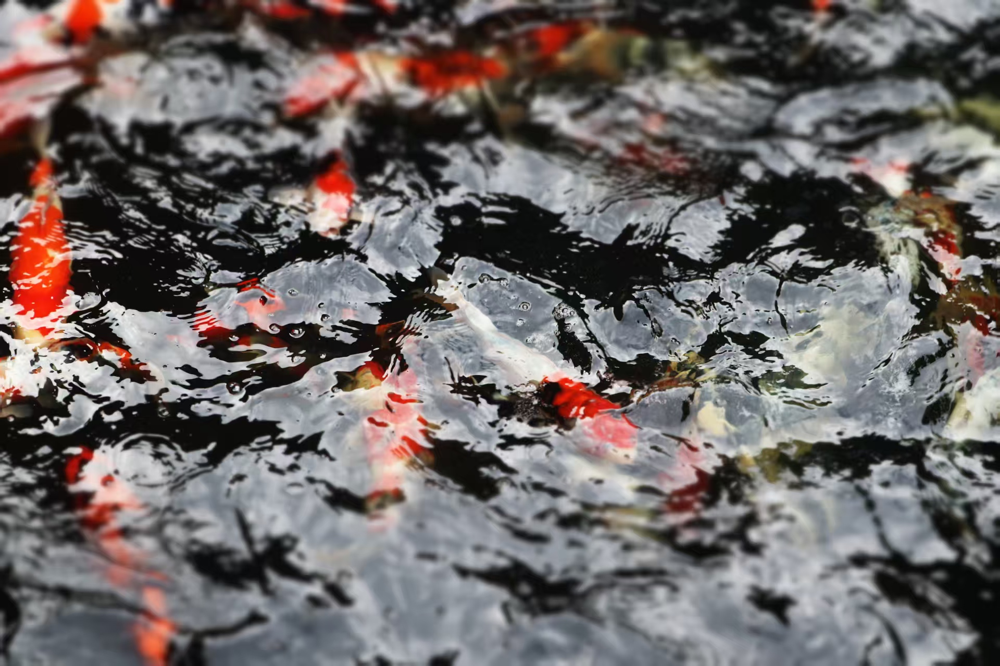

# 忙碌的高三生的苦中寻乐……

2418 朱麒荣

---

每当晚饭过后，漫步在教室外的走廊，抬头便撞进漫天晚霞里，中间灰白色云朵恰好把天空划分成蓝、橙两色，觉着新奇与震撼。拿起相机，按下快门，记录下这一刻的感觉令人惬意与安心，为高三繁忙的学习生活踩了踩刹车。

「落霞与孤鹜齐飞，秋水共长天一色」，拍下这张照片时突然想到的。看来欣赏风景还能顺便背背古诗词。

捣鼓相机时意外地拍出了这张照片，两层云将太阳聚焦于中心，太阳光照得云层「波光粼粼」。这场景像是两条龙争夺海中明珠的瞬间，恢弘雄壮。拍摄时间是白天，却意外地渲染出紧张的氛围。

这是高二时学校的小河塘，「俶尔远逝，往来翕忽」，说的就是这场景吧，斑斓鳞影搅碎一池静水，红、白、墨色的鱼儿们聚散游动，像是要赶集似的。静静看着它们自在穿梭，心里的烦躁会降下来不少。可惜高三池子翻了新，虽比往时池水清澈了不少，但昔时赏鱼的感觉却消散了许多。听说最近徘徊在蓝青河的飞鸟叼走了现在河塘中的锦鲤，为锦鲤哀悼一秒钟……
